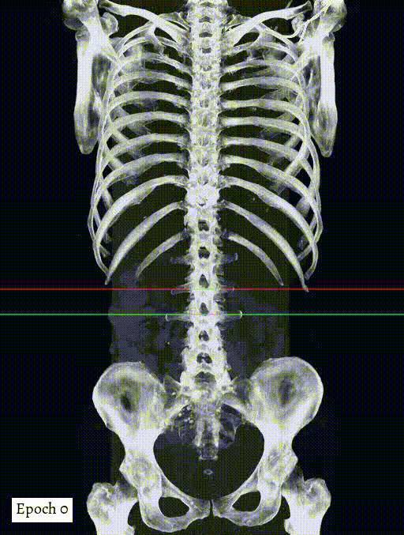
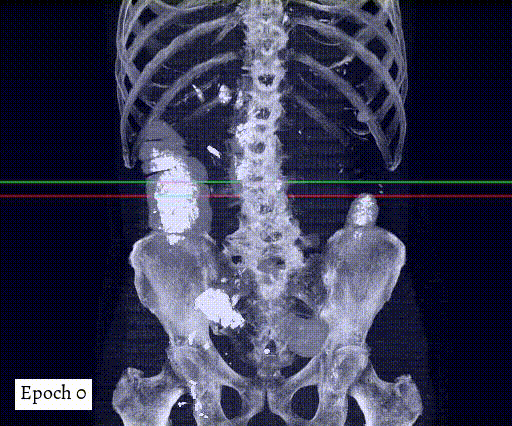
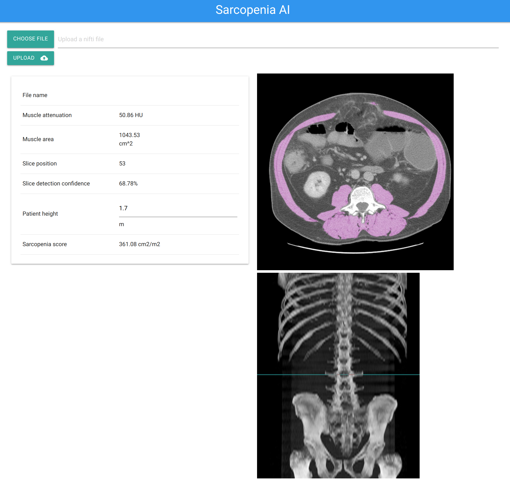

# Sarcopenia AI

Code for papers:

Kanavati, F., Islam, S., Aboagye, E. O., & Rockall, A. (2018). Automatic L3 slice detection in 3D CT images using fully-convolutional networks. arXiv preprint arXiv:1811.09244.

Kanavati, F., Islam, S., Arain, Z., Aboagye, E. O., & Rockall, A. (2020). 
Fully-automated deep learning slice-based muscle estimation from CT images for sarcopenia assessment. arXiv preprint arXiv:2006.06432.

### Models

Trained models for slice detection and slice segmentation are provided in `models/`

### Dev

```
conda create -y --name sarcopenia-ai python=3.6.2
```

Install

```bash
pip install -e .
```

### Docker

#### Build docker image
```bash
docker build -t sarcopeniaai -f ./Dockerfile .
```

or `make build`

#### Slice detection trainer

Download the training data from [here](https://imperialcollegelondon.box.com/s/0vt07mxy0re4zwao0sk76ywdt2s1pclm) 
to your data folder. 

```
docker run --rm -it  -v <your_data_folder>:/data -v $(pwd)/configs:/configs sarcopeniaai python -m sarcopenia_ai.apps.slice_detection.trainer --config /configs/slice_detection.cfg
```

Training output preview on validation images

 

#### Segmentation trainer

Labelled segmentation data is not provided. Once you get your own data, you can train a segmentation model with

```bash
docker run --rm -it -v <your_data_folder>:/data -v $(pwd)/configs:/configs sarcopeniaai python -m sarcopenia_ai.apps.segmentation.trainer --config /configs/segmentation.cfg
```

#### Run as API server

`docker run --rm -it -p 5000:5000 sarcopeniaai python -m sarcopenia_ai.apps.server.run_local_server`

or `make server`

Then head to http://localhost:5000 for web UI



You can also get results from command line. Example:

`curl -X POST -F image=@data/volume.nii.gz http://localhost:5000/predict`

Expected result
```json
{
   "prediction":{
      "id":"64667bf3482d4ee5a0e8af6c67b2fa0d",
      "muscle_area":"520.15",
      "muscle_attenuation":"56.00 HU",
      "slice_prob":"69.74%",
      "slice_z":90,
      "str":"Slice detected at position 90 of 198 with 69.74% confidence "
   },
   "success":true
}
```


### L3 annotated dataset

The dataset was collected from multiple sources:

 1. 3 sets were obtained from [the Cancer Imaging Archive (TCIA)](http://www.cancerimagingarchive.net/): 
 
     - [head and neck](http://doi.org/10.7937/K9/TCIA.2017.umz8dv6s)
     - [ovarian](http://dx.doi.org/10.7937/K9/TCIA.2016.NDO1MDFQ) 
     - [colon](http://doi.org/10.7937/K9/TCIA.2015.NWTESAY1)
       
 2. a liver tumour dataset was obtained from the 
 [LiTS segmentation challenge](https://competitions.codalab.org/competitions/17094).
 

The dataset is available for download in MIPs format from 
[here](https://imperialcollegelondon.box.com/s/0vt07mxy0re4zwao0sk76ywdt2s1pclm).

The subset of transitional vertabrae cases can be downloaded from 
[here](https://imperialcollegelondon.box.com/s/mw7ysamajjcp1ot0721e6nl36xku0acv).


```
@article{kanavati2018automatic,
  title={Automatic L3 slice detection in 3D CT images using fully-convolutional networks},
  author={Kanavati, Fahdi and Islam, Shah and Aboagye, Eric O and Rockall, Andrea},
  journal={arXiv preprint arXiv:1811.09244},
  year={2018}
}


@article{kanavati2020fullyautomated,
    title={Fully-automated deep learning slice-based muscle estimation from CT images for sarcopenia assessment},
    author={Fahdi Kanavati and Shah Islam and Zohaib Arain and Eric O. Aboagye and Andrea Rockall},
    year={2020},
    eprint={2006.06432},
    archivePrefix={arXiv},
    primaryClass={eess.IV}
}
```
